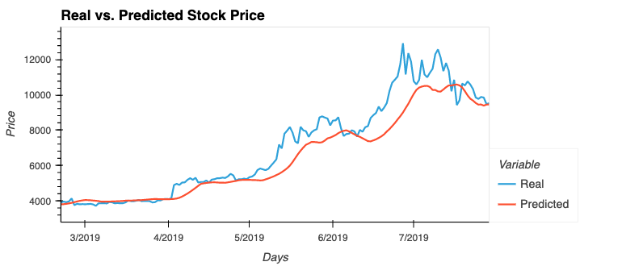
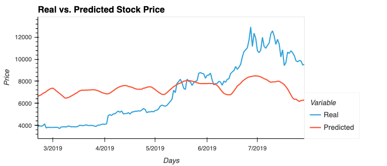

# LSTM Stock Predictor

Due to the volatility of cryptocurrency speculation, investors will often try to incorporate sentiment from social media and news articles to help guide their trading strategies. One such indicator is the [Crypto Fear and Greed Index (FNG)](https://alternative.me/crypto/fear-and-greed-index/) which attempts to use a variety of data sources to produce a daily FNG value for cryptocurrency. You have been asked to help build and evaluate deep learning models using both the FNG values and simple closing prices to determine if the FNG indicator provides a better signal for cryptocurrencies than the normal closing price data.

In this assignment, we will use deep learning recurrent neural networks to model bitcoin closing prices. One model will use the FNG indicators to predict the closing price while the second model will use a window of closing prices to predict the nth closing price.

We will need to:

1. [Prepare the data for training and testing](#prepare-the-data-for-training-and-testing)
2. [Build and train custom LSTM RNNs](#build-and-train-custom-lstm-rnns)
3. [Evaluate the performance of each model](#evaluate-the-performance-of-each-model)

- - -

### Files

[Closing Prices Starter Notebook](NoteBook/lstm_stock_predictor_closing.ipynb)

[FNG Starter Notebook](NoteBook/lstm_stock_predictor_fng.ipynb)

- - -

### Prepare the data for training and testing

For the Fear and Greed model, we use the FNG values to try and predict the closing price.

For the closing price model, we will use previous closing prices to try and predict the next closing price. 

Each model will need to use 70% of the data for training and 30% of the data for testing.

Apply a MinMaxScaler to the X and y values to scale the data for the model.

Finally, reshape the X_train and X_test values to fit the model's requirement of samples, time steps, and features. (*example:* `X_train = X_train.reshape((X_train.shape[0], X_train.shape[1], 1))`)

### Build and train custom LSTM RNNs

In each Jupyter Notebook, create the same custom LSTM RNN architecture. In one notebook, we will fit the data using the FNG values. In the second notebook, we will fit the data using only closing prices.

Use the same parameters and training steps for each model. This is necessary to compare each model accurately.

### Evaluate the performance of each model

Finally, use the testing data to evaluate each model and compare the performance.

Use the above to answer the following:

> Which model has a lower loss?

> The Closing Prices model had much lower loss than that of the FNG model. Closing Prices model trained relatively well with the loss falling from 0.0.0092 for epoch 10 to 0.0062 for epoch 50, the FNG Model loss remaining at the 0.0662 for epoch 10 where 0.0512 for epoch 50.

> Which model tracks the actual values better over time?

> The Closing Prices model track the actual values much better than the FNG Model whose predicted prices show almost no link with the actual prices.

> Which window size works best for the model?

> For the Closing Prices model, decreasing the window size from the initial value of 10 to 5 produced a smaller loss in both cases. This is probably deu to the fact that the longer term window was able to capture some longer term monthly patterns whereas the shorter window could respond faster to short term volatility. In the end, I kept the window size at 10. 
For the FNG model, reducing the window size to 5 and then to 3 improved significantly the link between the predicted and the actual prices. I kept the window size at 10 so that it is the same as for the Closing Prices model.

The Closing Prices Model

The FNG Model

- - -

### Resources

[Keras Sequential Model Guide](https://keras.io/getting-started/sequential-model-guide/)

[Illustrated Guide to LSTMs](https://towardsdatascience.com/illustrated-guide-to-lstms-and-gru-s-a-step-by-step-explanation-44e9eb85bf21)

[Stanford's RNN Cheatsheet](https://stanford.edu/~shervine/teaching/cs-230/cheatsheet-recurrent-neural-networks)

- - -
